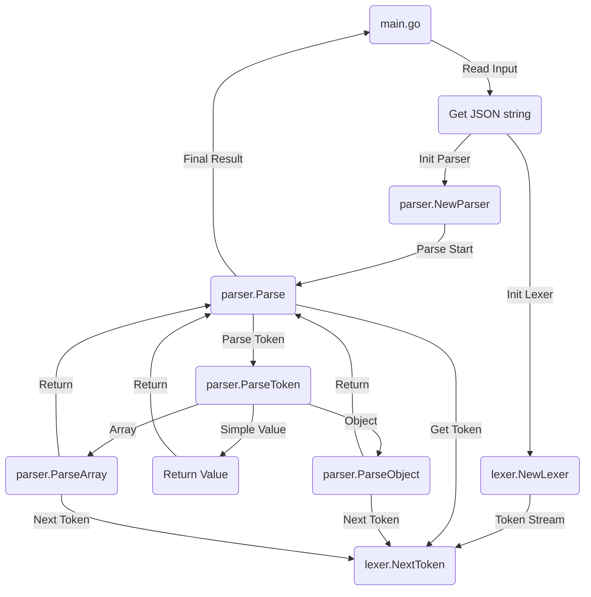

# go-json-parser
A simple JSON parser written in Go.

## Features

- Parse JSON strings.
- Interactive mode.
- Validate JSON Objects with boolean result on the console.


## Usage

1. Clone the repository.
2. Run the following command to build the project:
```bash
go build -o json-parser main.go
```
3. Run the following command to parse a JSON:
```bash

./json-parser '{"key": "value"}'

or

./json-parser

for interactive mode.

// then type your JSON and press enter


{"key": "value"}
```

## References

These are the references used to build this project:

- [RFC7159](https://datatracker.ietf.org/doc/html/rfc7159)
- [JSON.org](https://www.json.org/json-en.html)
- [JSONApi](https://jsonapi.org/format/)

## Todo

- [ ] RFC7159 compliance
- [ ] Extend cli parser to web server

## Flowchart


